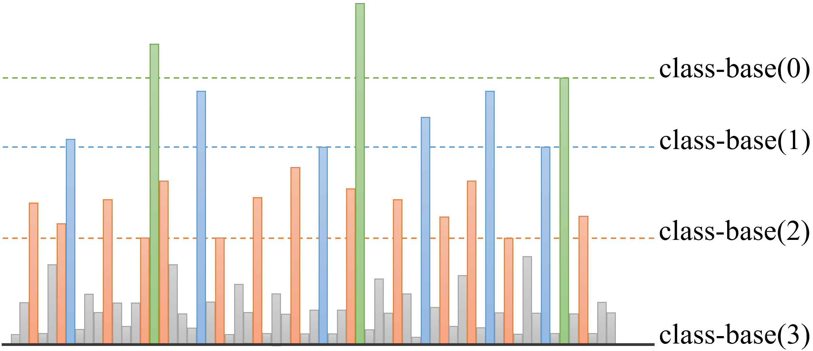

# RobustSL - Evaluation Scripts

This repository houses a comprehensive Python environment dedicated to the evaluation of skiplist based learning augmented dictionary called RobustSL which is published asa paper in ICML 2024 [[arxiv]](https://arxiv.org/html/2402.09687v1).

Features:
- RobustSL Implementations: Contains implementations of robust and consistent dictionary of RobustSL.
- Implementation of SOTA dictionaries: Including BST, AVL-Tree, RedBlack Tree, Knuth Optimal Tree, Splay Tree, and Learned-Treaps.
- Synthetic data generator.
- Dynamic and Static evaluations.

<p align="center">

</p>


## Implementation of your dictionary
You can even evaluate your new designed dictionary with other SOTA dictionaries using this evaluator. For this task, create a class for your dictionary using the following interface:
``` 
from DS import *

class NAME_OF_YOUR_DICTIONARY(DS):

    # if it supports insertion, otherwise skip it
    def insert(self, key, freq):
        pass
		
    # if it supports deletion, otherwise skip it
    def delete(self, key):
        pass
		
    def search(self, key_Value, __splay_cost__=False):
        return None # founded object
```
Then you can simply evaluate your model using "TestDS" function.

## Clone the project
```bash
git clone https://github.com/ali-zeynali/RobustSL-ICML-2024
```
```bash
cd RobustSL-ICML-2024/
```
## Dataset
The dataset used for for evaluation parts comes from synthetic dataset generated using "DataGenerator.py" class and real BBC news dataset which is accessible from link below
- BBC news article dataset: [[Link]](https://www.kaggle.com/datasets/shivamkushwaha/bbc-full-text-document-classification).

## Academic Use

If you use this environment for academic research or in an academic paper, we kindly request that you cite our original paper [RobustSL](https://arxiv.org/pdf/2402.09687v1):

[Zeynali, Ali, Shahin Kamali, and Mohammad Hajiesmaili. "Robust Learning-Augmented Dictionaries."][[arxiv]](https://arxiv.org/pdf/2402.09687v1)

We appreciate your acknowledgment and support in citing our work.

## License
This project is licensed under the [Creative Commons Attribution-NonCommercial International License](https://creativecommons.org/licenses/by-nc/4.0/).


## Questions
Feel free to share your comments and thoughts regarding this project or ask me your question via my email address: "a" + __MY LASTNAME__ + "@umass.edu"